#  DevAssist

> **Autonomous Multi-Agent AI Software Engineering Platform**

> **Note:** This is a production-ready README template. Replace
> placeholder images in `docs/screenshots/`.

------------------------------------------------------------------------

##  Dashboard Preview


------------------------------------------------------------------------

##  Feature Highlights

  -----------------------------------------------------------------------
  AI                Repository        Analytics         Productivity
  ----------------- ----------------- ----------------- -----------------
  AI Repository     GitHub Import     Repository        AI Code Review
  Chat                                Analytics         

  Documentation     Repository        Activity Timeline README Generator
  Generator         Explorer                            

  Architecture      Semantic Search   Token Usage       Architecture
  Generator                                             Diagrams

  RAG Search        File Explorer     Processing Status AI Suggestions
  -----------------------------------------------------------------------

------------------------------------------------------------------------

##  Table of Contents

-   About
-   Features
-   Screenshots
-   Architecture
-   Workflows
-   Tech Stack
-   Folder Structure
-   Installation
-   Environment Variables
-   API Documentation
-   Database Design
-   Security
-   Performance
-   Testing
-   Docker
-   CI/CD
-   Deployment
-   Roadmap
-   Contributing
-   License

------------------------------------------------------------------------

#  About

DevAssist is an enterprise-grade AI software engineering assistant that
imports GitHub repositories, indexes code, builds embeddings,
orchestrates multiple AI agents with LangGraph, and provides repository
chat, semantic search, documentation generation, architecture diagrams,
README generation, and AI code reviews.

------------------------------------------------------------------------

#  Overall Application Workflow

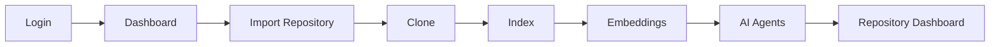

#  Repository Import Workflow

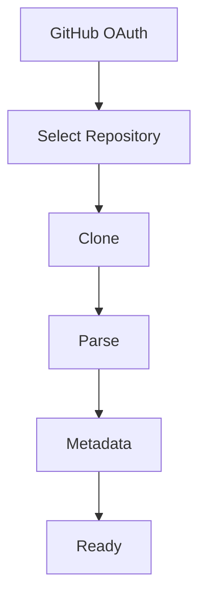

#  Repository Indexing Pipeline

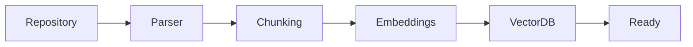

#  AI Repository Chat (RAG)

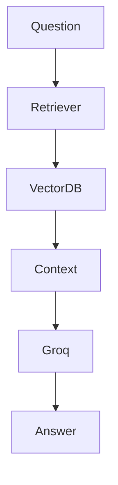

#  Multi-Agent Workflow

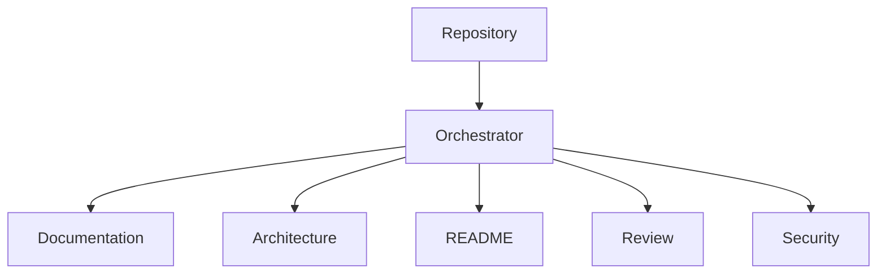

#  Semantic Search

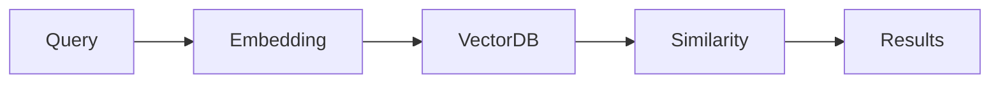

#  Documentation Generation

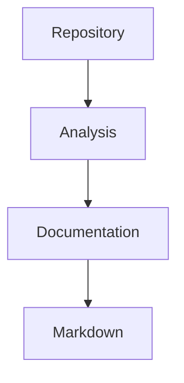

#  README Generation

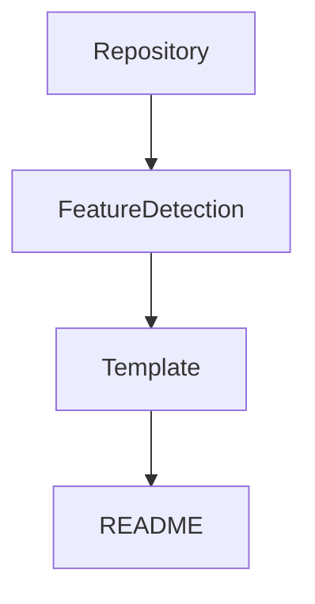

#  AI Code Review

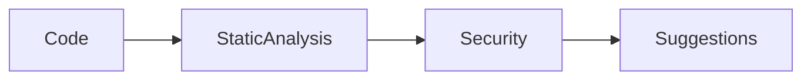

#  Architecture Generation

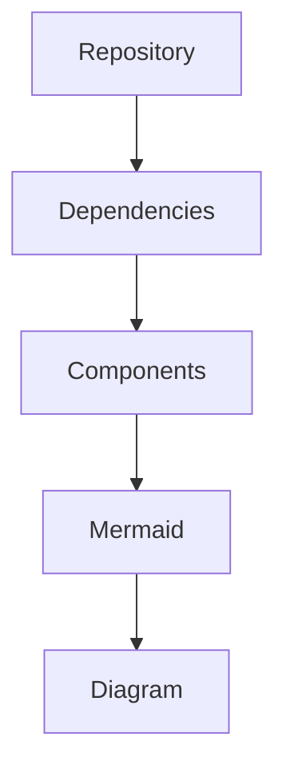

#  Authentication Flow

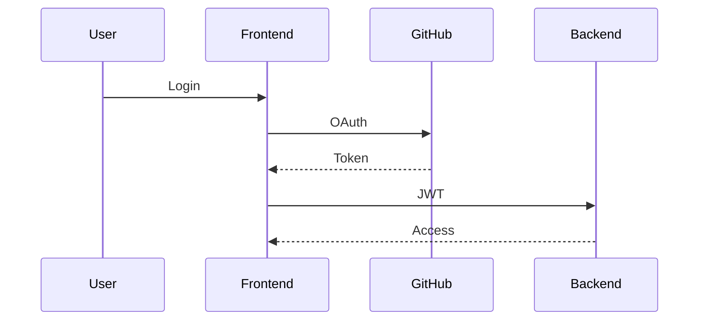

#  API Request Flow

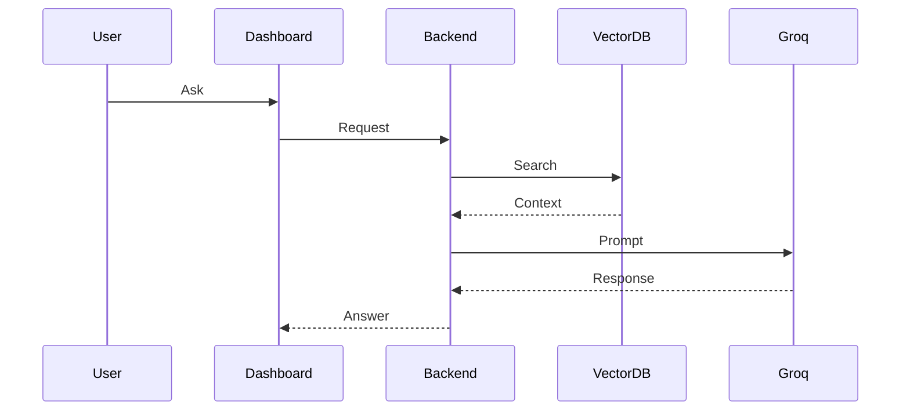

#  End-to-End AI Pipeline

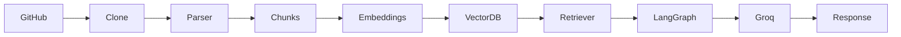

#  Dashboard Navigation

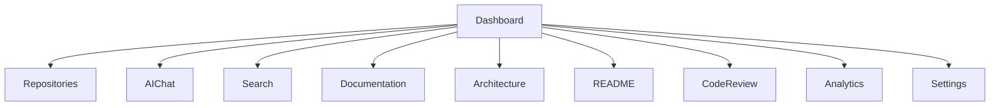

#  Tech Stack

  Layer        Technology
  ------------ ---------------------------------
  Frontend     React, TypeScript, Tailwind CSS
  Backend      Node.js, Express
  AI           LangGraph, LangChain, Groq
  Database     SQLite
  Deployment   Docker

#  Folder Structure

``` text
dashboard/
api/
agents/
orchestrator/
core/
docs/
```

#  Installation

``` bash
git clone <repo>
cd devassist
npm install
npm run dev
```

#  Environment Variables

  Variable       Description
  -------------- --------------
  GROQ_API_KEY   Groq API Key
  JWT_SECRET     JWT Secret
  PORT           Server Port

#  API Documentation

  Method   Endpoint
  -------- ----------------
  GET      /repositories
  POST     /repositories
  POST     /chat
  POST     /search
  POST     /documentation
  POST     /review

#  Security

-   JWT Authentication
-   Protected API Routes
-   GitHub OAuth
-   Environment-based secrets

#  Performance

-   Parallel AI agents
-   Incremental indexing
-   Vector search
-   Background processing

# Roadmap

## Completed

-   Repository Import
-   AI Chat
-   Semantic Search
-   Documentation
-   Architecture
-   README
-   Code Review

## Planned

-   VS Code Extension
-   CLI
-   Team Collaboration
-   MCP

# Contributing

Fork → Branch → Commit → PR

# License

MIT

------------------------------------------------------------------------

::: {align="center"}
## ⭐ Star the project if you found it useful!

Built with ❤️ by **Yash Vardhan**
:::
