<div align="center">

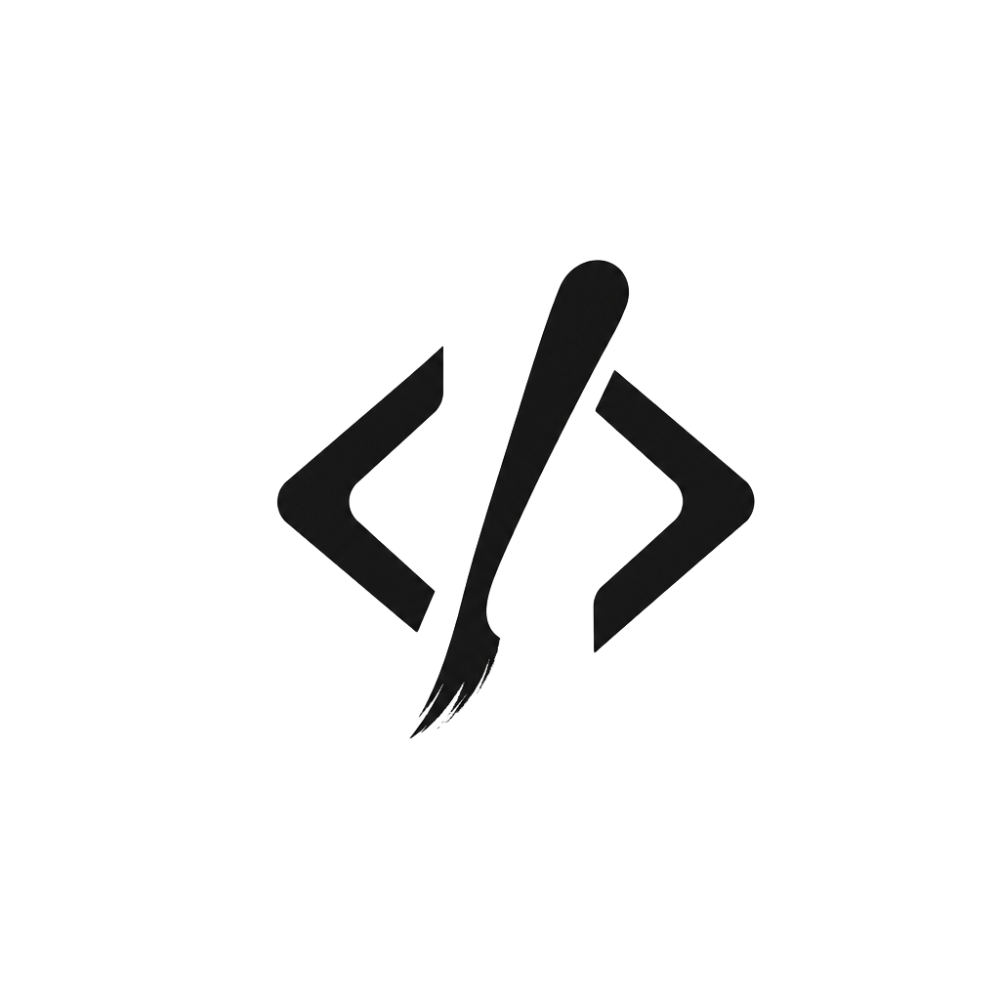

# DevAssist

### Autonomous Multi-Agent AI Software Engineering Platform

<p>

**AI-powered Repository Intelligence • Code Understanding • Documentation • Architecture • Code Review • Semantic Search**

</p>

<p>

Build enterprise-grade software faster with autonomous AI agents capable of understanding, analyzing, documenting, reviewing, and explaining entire GitHub repositories.

Powered by **LangGraph**, **LangChain**, **Groq**, **React**, **TypeScript**, and **RAG**.

</p>

<br>


<br><br>

<a href="#-installation">


</a>

<a href="#-features">


</a>

<a href="#-architecture">


</a>

<a href="#-roadmap">


</a>

</div>

---

# Dashboard Preview

> Replace the image below with your latest dashboard screenshot.

<p align="center">

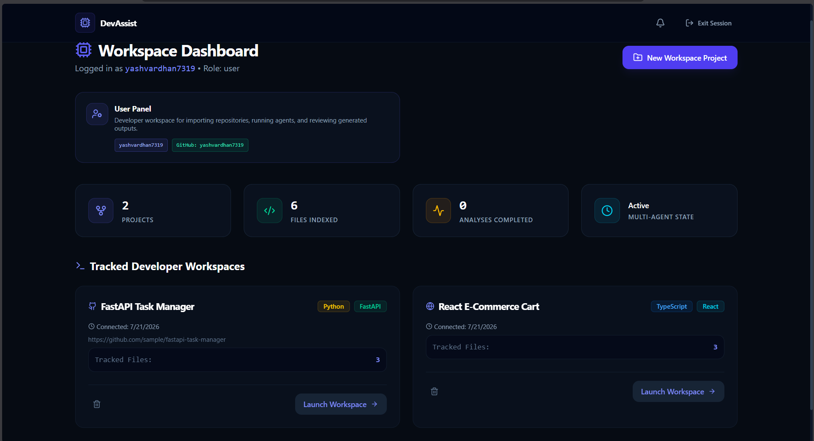

</p>

---

# Feature Highlights

| AI | Repository | Analytics | Productivity |
|-------|---------------|--------------|----------------|
| AI Repository Chat | GitHub Import | Repository Analytics | AI Code Review |
| Documentation Generator | Repository Explorer | Activity Timeline | README Generator |
| Architecture Generator | Semantic Search | Token Usage | Architecture Diagrams |
| RAG Search | File Explorer | Repository Status | AI Suggestions |
| Security Analysis | Dependency Graph | Processing Metrics | Smart Refactoring |
| Code Explanation | Branch Support | Health Score | AI Reports |

---

# Why DevAssist?

<div align="center">

| Understand | Search | Automate |
|--------------|-----------|-------------|
| Explain any repository instantly | Semantic repository search | Autonomous AI agents |

| Document | Review | Design |
|-------------|-----------|-----------|
| Generate complete documentation | AI-powered code reviews | Automatic architecture diagrams |

</div>

---

# What Can DevAssist Do?

Import GitHub repositories

Clone repositories automatically

Parse complete codebases

Build vector embeddings

Generate AI documentation

Explain files and folders

Generate architecture diagrams

Review code quality

Detect security issues

Semantic repository search

README generation

Dependency analysis

Repository analytics

AI Repository Chat

Multi-Agent orchestration

---

---

# Table of Contents

- [About DevAssist](#about-devassist)
- [Problem Statement](#problem-statement)
- [Solution Overview](#solution-overview)
- [Project Vision](#project-vision)
- [Why DevAssist?](#why-devassist)
- [Enterprise Use Cases](#enterprise-use-cases)
- [Core Capabilities](#core-capabilities)
- [Key Highlights](#key-highlights)
- [Project Goals](#project-goals)
- [Target Users](#target-users)

---

# About DevAssist

**DevAssist** is an enterprise-grade AI Software Engineering Platform that combines **Large Language Models (LLMs)**, **Retrieval-Augmented Generation (RAG)**, **LangGraph**, and **Multi-Agent AI** to help developers understand, analyze, document, review, and maintain software repositories with minimal manual effort.

Instead of acting as a traditional chatbot, DevAssist functions as an intelligent software engineering assistant capable of reasoning across an entire repository. It understands relationships between files, interprets project architecture, performs semantic code search, generates documentation, identifies security issues, reviews pull requests, and answers repository-specific questions using contextual retrieval.

The platform is designed to accelerate software development workflows, improve code quality, reduce onboarding time, and provide engineering teams with AI-powered insights throughout the software development lifecycle.

Whether working on a small open-source project or a large enterprise codebase, DevAssist provides developers with a centralized AI workspace for repository intelligence.

---

# Problem Statement

Modern software repositories are growing larger and more complex every year.

Engineering teams frequently struggle with:

- Understanding unfamiliar codebases
- Reading thousands of source files
- Navigating deeply nested project structures
- Keeping documentation synchronized with code
- Reviewing pull requests efficiently
- Identifying security vulnerabilities
- Performing semantic code searches
- Onboarding new developers
- Understanding system architecture
- Maintaining consistent coding standards

Traditional code search tools rely heavily on keyword matching and static indexing, making them insufficient for understanding the true semantic relationships within large software projects.

As repositories scale, these challenges lead to:

- Increased onboarding time
- Reduced developer productivity
- Higher maintenance costs
- Poor documentation quality
- Technical debt accumulation
- Security risks
- Inefficient collaboration

---

# Solution Overview

DevAssist addresses these challenges through an autonomous AI-powered repository intelligence platform.

The platform automatically:

- Imports repositories from GitHub
- Clones project source code
- Parses every source file
- Generates semantic embeddings
- Builds an AI-searchable knowledge base
- Indexes repository metadata
- Understands project architecture
- Creates documentation automatically
- Generates README files
- Reviews source code
- Detects security issues
- Produces architecture diagrams
- Answers repository questions using RAG
- Coordinates specialized AI agents through LangGraph

Instead of manually exploring hundreds of files, developers can simply ask natural language questions and receive accurate, context-aware answers generated directly from their codebase.

---

# Project Vision

Our vision is to build the next generation of AI-powered software engineering assistants capable of acting as intelligent collaborators rather than simple code generators.

DevAssist aims to become an autonomous engineering platform capable of:

- Understanding complete software systems
- Assisting developers throughout the SDLC
- Reducing repetitive engineering tasks
- Improving software quality automatically
- Accelerating onboarding
- Enhancing collaboration
- Providing actionable engineering insights
- Automating documentation
- Assisting code reviews
- Supporting enterprise-scale software development

The long-term objective is to transform software repositories into interactive, AI-powered knowledge systems that continuously evolve alongside the codebase.

---

# Why DevAssist?

Unlike traditional AI coding assistants that focus primarily on code completion, DevAssist analyzes and understands entire repositories.

### Traditional Development Workflow

```
Developer

↓

Read Documentation

↓

Search Files

↓

Open Multiple Files

↓

Understand Architecture

↓

Analyze Dependencies

↓

Review Code

↓

Write Documentation
```

---

### DevAssist Workflow

```
Developer

↓

Ask Question

↓

DevAssist

↓

Repository Understanding

↓

Multi-Agent Analysis

↓

AI Reasoning

↓

Accurate Response
```

---

## What Makes DevAssist Different?

| Traditional Tools | DevAssist |
|-------------------|-----------|
| Keyword Search | Semantic Repository Search |
| File-Level Context | Repository-Level Context |
| Manual Documentation | AI Documentation Generation |
| Manual Code Reviews | AI Code Review |
| Static Architecture | AI Architecture Generation |
| Single AI Model | Multi-Agent System |
| Basic Chatbot | Context-Aware Repository Assistant |
| Manual Analysis | Autonomous AI Workflows |
| Generic Responses | Repository-Specific Intelligence |

---

# Enterprise Use Cases

DevAssist is suitable for a wide range of software engineering workflows.

### Software Development

- Repository understanding
- Feature implementation
- Code explanation
- Refactoring assistance
- Dependency analysis

---

### Enterprise Teams

- Developer onboarding
- Architecture documentation
- Security auditing
- Knowledge sharing
- Repository governance

---

### Code Reviews

- Pull request analysis
- Code quality assessment
- Best practice recommendations
- Bug detection
- Maintainability analysis

---

### Documentation

- README generation
- API documentation
- Technical documentation
- Architecture documentation
- Knowledge base creation

---

### Security

- Vulnerability detection
- Dependency inspection
- Secret detection
- Security recommendations
- OWASP compliance checks

---

### Engineering Analytics

- Repository insights
- Code statistics
- Project health metrics
- Development trends
- AI-generated reports

---

# Core Capabilities

DevAssist provides a complete suite of AI-powered software engineering capabilities.

| Capability | Description |
|------------|-------------|
| AI Repository Chat | Ask repository-specific questions using natural language |
| GitHub Integration | Import public and private repositories |
| Documentation Generator | Automatically generate project documentation |
| README Generator | Create professional README files |
| Architecture Generator | Generate Mermaid architecture diagrams |
| Semantic Search | Search repositories using meaning instead of keywords |
| Security Analysis | Detect vulnerabilities and security risks |
| Dependency Analysis | Understand module relationships |
| Repository Analytics | Visualize repository insights |
| Multi-Agent AI | Specialized AI agents collaborate autonomously |
| Project Insights | Repository health and engineering metrics |
| AI Code Review | Automated code quality evaluation |

---

# Key Highlights

Enterprise-grade architecture

Multi-Agent AI workflows powered by LangGraph

Retrieval-Augmented Generation (RAG)

Repository-aware conversational AI

Semantic repository search

Automatic documentation generation

AI architecture visualization

AI code review

Security auditing

Dependency analysis

Repository analytics dashboard

Modern React + TypeScript frontend

Fast Groq-powered inference

Scalable backend architecture

Extensible plugin-based agent system

---

# Project Goals

The primary objectives of DevAssist are:

- Simplify repository understanding
- Improve developer productivity
- Reduce onboarding time
- Automate documentation
- Increase software quality
- Improve engineering collaboration
- Enable AI-assisted software engineering
- Build an extensible multi-agent ecosystem
- Provide enterprise-ready repository intelligence

---

# Target Users

DevAssist is designed for:

- Software Engineers
- Full Stack Developers
- Backend Developers
- Frontend Developers
- DevOps Engineers
- Platform Engineers
- Solution Architects
- Technical Leads
- Engineering Managers
- Open Source Contributors
- Startup Teams
- Enterprise Development Teams
- Students learning large codebases
- AI-assisted software engineering researchers

---

---

# Architecture

DevAssist follows a modular, AI-first architecture designed to analyze, understand, and reason over complete software repositories. The platform combines modern web technologies with Retrieval-Augmented Generation (RAG), vector search, and autonomous multi-agent orchestration to deliver repository-aware AI assistance.

The architecture is designed around the following principles:

- **Modularity** – Each subsystem is isolated and independently scalable.
- **Extensibility** – New AI agents and services can be integrated without changing the core architecture.
- **Parallel Processing** – Independent AI tasks execute concurrently using LangGraph.
- **Context Awareness** – Every AI response is grounded in repository-specific knowledge retrieved from vector embeddings.
- **Developer Experience** – A responsive React dashboard provides real-time visibility into repository processing and AI execution.

---

# High-Level System Architecture

The following diagram illustrates the major components of DevAssist and how they interact.

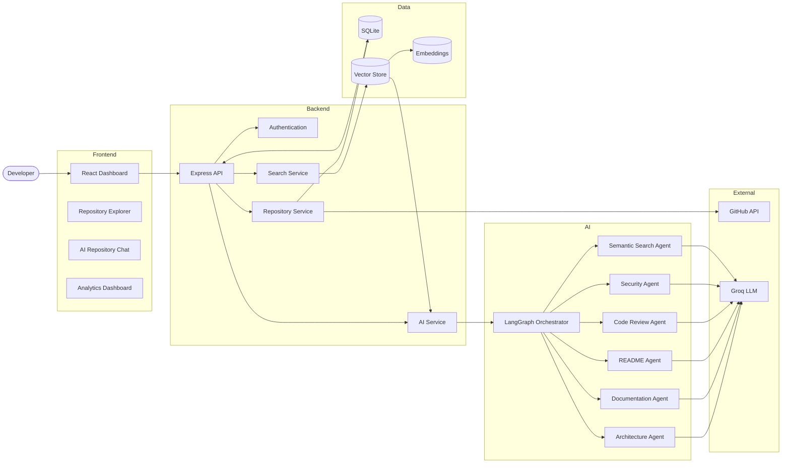
```mermaid
flowchart LR
User([Developer])
subgraph Frontend
UI[React Dashboard]
Explorer[Repository Explorer]
Chat[AI Repository Chat]
Analytics[Analytics Dashboard]
end
subgraph Backend
API[Express API]
Auth[Authentication]
RepoService[Repository Service]
SearchService[Search Service]
AIService[AI Service]
end
subgraph AI
Orchestrator[LangGraph Orchestrator]
ArchAgent[Architecture Agent]
DocAgent[Documentation Agent]
ReadmeAgent[README Agent]
ReviewAgent[Code Review Agent]
SecurityAgent[Security Agent]
SearchAgent[Semantic Search Agent]
end
subgraph Data
SQLite[(SQLite)]
VectorDB[(Vector Store)]
Embeddings[(Embeddings)]
end
subgraph External
GitHub[GitHub API]
Groq[Groq LLM]
end
User --> UI
UI --> API
API --> Auth
API --> RepoService
API --> SearchService
API --> AIService
RepoService --> GitHub
RepoService --> SQLite
SearchService --> VectorDB
AIService --> Orchestrator
Orchestrator --> ArchAgent
Orchestrator --> DocAgent
Orchestrator --> ReadmeAgent
Orchestrator --> ReviewAgent
Orchestrator --> SecurityAgent
Orchestrator --> SearchAgent
ArchAgent --> Groq
DocAgent --> Groq
ReadmeAgent --> Groq
ReviewAgent --> Groq
SecurityAgent --> Groq
SearchAgent --> Groq
VectorDB --> Embeddings
SQLite --> API
VectorDB --> AIService
```

---

# Component Architecture

DevAssist is divided into several independent modules that communicate through well-defined interfaces.

| Layer | Responsibility |
|---------|----------------|
| Frontend | Dashboard, Repository Explorer, AI Chat, Analytics |
| API Layer | Authentication, REST APIs, Repository Management |
| Service Layer | Business Logic and Repository Processing |
| AI Layer | LangGraph Multi-Agent Orchestration |
| Knowledge Layer | Vector Embeddings and Semantic Search |
| Data Layer | SQLite Database and Repository Metadata |
| External Services | GitHub API and Groq LLM |

---

# Layered Architecture

The application follows a layered architecture to separate concerns and improve maintainability.

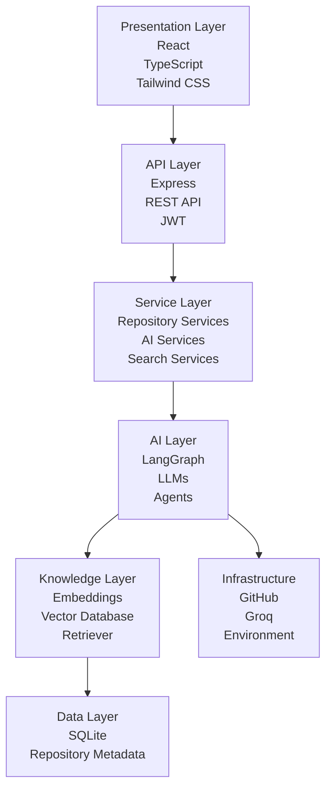
```mermaid
flowchart TD
Presentation["Presentation Layer
React
TypeScript
Tailwind CSS"]
API["API Layer
Express
REST API
JWT"]
Service["Service Layer
Repository Services
AI Services
Search Services"]
AI["AI Layer
LangGraph
LLMs
Agents"]
Knowledge["Knowledge Layer
Embeddings
Vector Database
Retriever"]
Database["Data Layer
SQLite
Repository Metadata"]
Infrastructure["Infrastructure
GitHub
Groq
Environment"]
Presentation --> API
API --> Service
Service --> AI
AI --> Knowledge
Knowledge --> Database
AI --> Infrastructure
```

---

# Core Components

## Frontend

The frontend provides an enterprise-grade developer experience through an interactive dashboard.

Major responsibilities include:

- Repository Explorer
- AI Chat
- Documentation Viewer
- Analytics Dashboard
- Mermaid Diagram Rendering
- Real-time Agent Status
- Processing Progress
- Authentication
- Responsive UI

Technology Stack

- React 19
- TypeScript
- Tailwind CSS
- Zustand
- React Query
- Framer Motion
- Mermaid.js

---

## Backend

The backend coordinates every operation inside DevAssist.

Responsibilities include:

- REST APIs
- Authentication
- Repository Import
- Repository Cloning
- Repository Parsing
- AI Request Routing
- Search APIs
- Documentation APIs
- Analytics APIs

Technology Stack

- Node.js
- Express
- TypeScript

---

## AI Layer

The AI Layer is responsible for repository reasoning.

Instead of sending one large prompt to an LLM, DevAssist distributes work among specialized AI agents coordinated by LangGraph.

Responsibilities include:

- Repository Understanding
- Architecture Analysis
- Documentation Generation
- README Generation
- Code Review
- Security Review
- Dependency Analysis
- Semantic Search

---

## Knowledge Layer

The Knowledge Layer powers Retrieval-Augmented Generation (RAG).

Every repository is transformed into searchable semantic embeddings.

Responsibilities:

- File Chunking
- Embedding Generation
- Vector Storage
- Similarity Search
- Context Retrieval
- Metadata Indexing

---

## Data Layer

Repository metadata is stored separately from vector embeddings.

SQLite stores:

- Users
- Repositories
- Chats
- Processing Status
- Agent Tasks
- Analytics
- Repository Metadata

The Vector Database stores:

- File Embeddings
- Chunk Embeddings
- Search Indexes
- Semantic Relationships

---

# Architecture Principles

DevAssist is built around the following engineering principles.

### Modular

Every subsystem is independently replaceable.

---

### Scalable

New AI agents can be introduced without modifying existing workflows.

---

### Parallel

Independent AI tasks execute simultaneously through LangGraph.

---

### Repository-Aware

Every AI response is grounded using Retrieval-Augmented Generation.

---

### Extensible

The platform is designed to support:

- Additional AI models
- Custom agents
- Multiple vector databases
- Enterprise authentication providers
- Cloud-native deployments

---

# Architecture Summary

| Category | Technology |
|------------|------------|
| Frontend | React + TypeScript |
| Backend | Node.js + Express |
| AI Framework | LangGraph |
| LLM | Groq |
| Knowledge Base | Vector Embeddings |
| Database | SQLite |
| Search | Semantic Vector Search |
| Authentication | JWT |
| Documentation | AI Generated |
| Architecture | AI Generated |
| Deployment | Docker Ready |

---

---

# Overall Application Workflow

The following diagram illustrates the complete lifecycle of a repository from import to AI-powered insights.

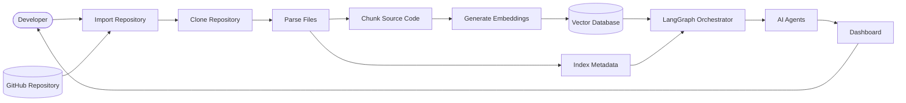
```mermaid
flowchart LR
User([Developer])
GitHub[(GitHub Repository)]
Import[Import Repository]
Clone[Clone Repository]
Parse[Parse Files]
Chunk[Chunk Source Code]
Embed[Generate Embeddings]
Vector[(Vector Database)]
Index[Index Metadata]
LangGraph[LangGraph Orchestrator]
Agents[AI Agents]
Dashboard[Dashboard]
User --> Import
GitHub --> Import
Import --> Clone
Clone --> Parse
Parse --> Chunk
Chunk --> Embed
Embed --> Vector
Parse --> Index
Vector --> LangGraph
Index --> LangGraph
LangGraph --> Agents
Agents --> Dashboard
Dashboard --> User
```

---

# Repository Import Workflow

DevAssist supports importing repositories from GitHub using Personal Access Tokens or public repository URLs.

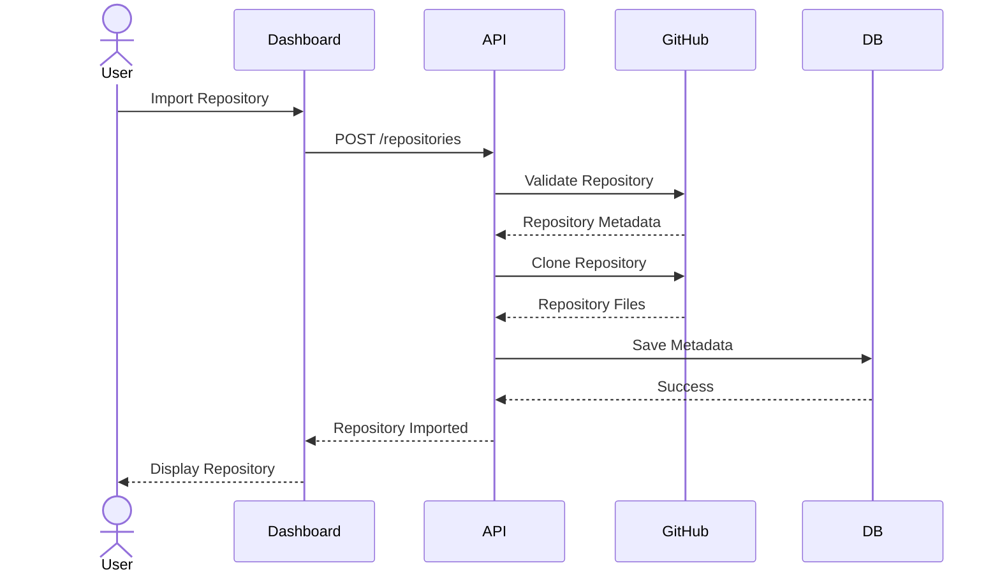
```mermaid
sequenceDiagram
actor User
participant UI as Dashboard
participant API
participant GitHub
participant DB
User->>UI: Import Repository
UI->>API: POST /repositories
API->>GitHub: Validate Repository
GitHub-->>API: Repository Metadata
API->>GitHub: Clone Repository
GitHub-->>API: Repository Files
API->>DB: Save Metadata
DB-->>API: Success
API-->>UI: Repository Imported
UI-->>User: Display Repository
```

---

# Repository Processing Pipeline

Once imported, the repository moves through several processing stages before becoming AI-ready.

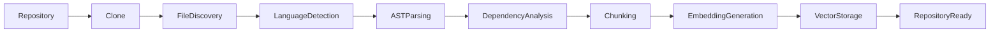
```mermaid
flowchart LR
Repository --> Clone --> FileDiscovery --> LanguageDetection --> ASTParsing --> DependencyAnalysis --> Chunking --> EmbeddingGeneration --> VectorStorage --> RepositoryReady
```

---

# File Parsing Workflow

Every source file is analyzed independently.

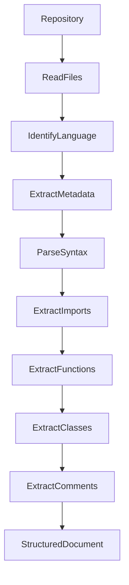
```mermaid
flowchart TD
Repository --> ReadFiles --> IdentifyLanguage --> ExtractMetadata --> ParseSyntax --> ExtractImports --> ExtractFunctions --> ExtractClasses --> ExtractComments --> StructuredDocument
```

---

# Chunking Pipeline

Large files are split into semantically meaningful chunks.

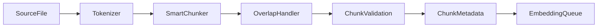
```mermaid
flowchart LR
SourceFile --> Tokenizer --> SmartChunker --> OverlapHandler --> ChunkValidation --> ChunkMetadata --> EmbeddingQueue
```

---

# Embedding Generation Pipeline

Each chunk is transformed into a vector representation for semantic retrieval.

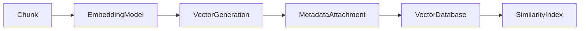
```mermaid
flowchart LR
Chunk --> EmbeddingModel --> VectorGeneration --> MetadataAttachment --> VectorDatabase --> SimilarityIndex
```

---

# Repository Indexing Workflow

Repository metadata and embeddings are indexed separately for efficient retrieval.

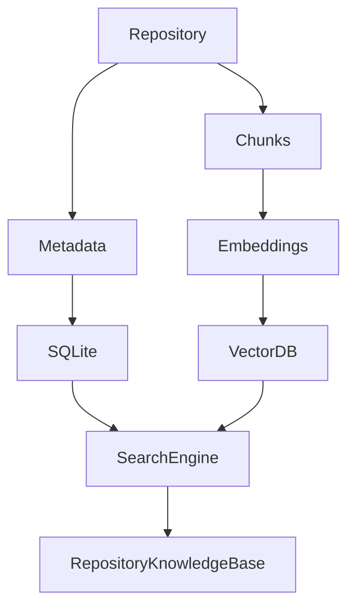
```mermaid
flowchart TD
Repository --> Metadata --> SQLite
Repository --> Chunks --> Embeddings --> VectorDB
SQLite --> SearchEngine
VectorDB --> SearchEngine
SearchEngine --> RepositoryKnowledgeBase
```

---

# Retrieval-Augmented Generation (RAG) Architecture

Every AI response is grounded in repository context using Retrieval-Augmented Generation.

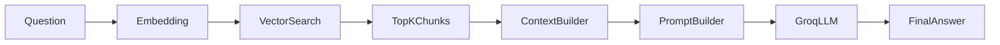
```mermaid
flowchart LR
Question --> Embedding --> VectorSearch --> TopKChunks --> ContextBuilder --> PromptBuilder --> GroqLLM --> FinalAnswer
```

---

# AI Repository Chat Workflow

Natural language questions are answered using repository-specific knowledge.

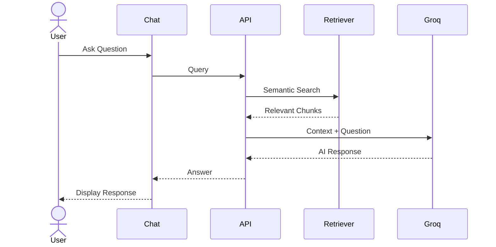
```mermaid
sequenceDiagram
actor User
participant Chat
participant API
participant Retriever
participant Groq
User->>Chat: Ask Question
Chat->>API: Query
API->>Retriever: Semantic Search
Retriever-->>API: Relevant Chunks
API->>Groq: Context + Question
Groq-->>API: AI Response
API-->>Chat: Answer
Chat-->>User: Display Response
```

---

# Semantic Search Workflow

Unlike keyword search, DevAssist searches by meaning.

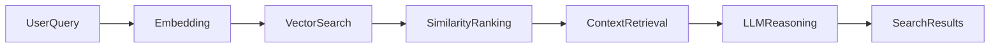
```mermaid
flowchart LR
UserQuery --> Embedding --> VectorSearch --> SimilarityRanking --> ContextRetrieval --> LLMReasoning --> SearchResults
```

---

# Repository Processing Stages

| Stage | Description |
|---------|-------------|
| Import | Repository registration |
| Clone | Download repository |
| Parse | Read source code |
| Analyze | Extract structure |
| Chunk | Split into semantic units |
| Embed | Generate vector embeddings |
| Index | Store searchable metadata |
| Retrieve | Perform semantic retrieval |
| Reason | AI reasoning with LangGraph |
| Respond | Generate contextual response |

---

# Pipeline Advantages

Repository-aware AI responses

Semantic understanding instead of keyword matching

Fast vector retrieval

Parallel repository indexing

Intelligent chunking strategy

Optimized context retrieval

Scalable knowledge base

Accurate AI reasoning

---

---

# Multi-Agent AI Architecture

DevAssist is powered by an autonomous **Multi-Agent AI System** built on **LangGraph**. Instead of relying on a single LLM prompt, the platform delegates repository analysis to specialized AI agents that execute independently and collaborate through a centralized orchestrator.

Each agent has a focused responsibility, allowing the system to perform complex repository analysis efficiently while maintaining modularity and scalability.

---

# LangGraph Orchestrator

The LangGraph Orchestrator serves as the central brain of the platform. It coordinates task execution, routes repository context to the appropriate AI agents, manages dependencies between tasks, and aggregates results into a unified response.

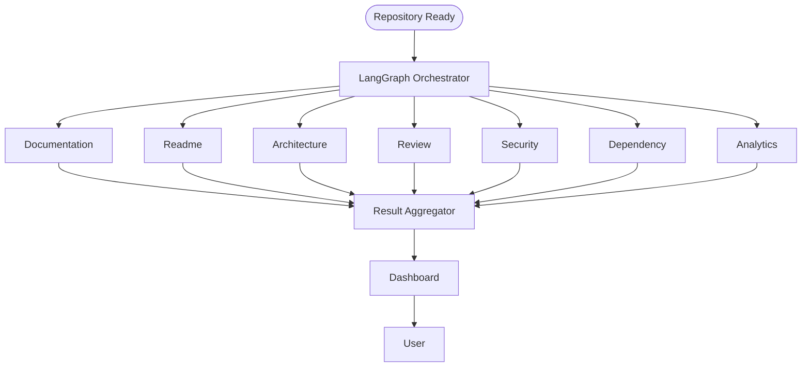
```mermaid
flowchart TD
Start([Repository Ready])
Start --> Planner
Planner[LangGraph Orchestrator]
Planner --> Documentation
Planner --> Readme
Planner --> Architecture
Planner --> Review
Planner --> Security
Planner --> Dependency
Planner --> Analytics
Documentation --> Merge
Readme --> Merge
Architecture --> Merge
Review --> Merge
Security --> Merge
Dependency --> Merge
Analytics --> Merge
Merge[Result Aggregator]
Merge --> Dashboard
Dashboard --> User
```

---

# AI Agent Responsibilities

| Agent | Responsibility |
|---------|---------------|
| Documentation Agent | Generates technical documentation |
| README Agent | Creates professional README.md files |
| Architecture Agent | Generates architecture diagrams and system documentation |
| Search Agent | Handles semantic repository search |
| Security Agent | Detects vulnerabilities and insecure code |
| Dependency Agent | Builds dependency graphs |
| Code Review Agent | Reviews source code quality |
| Analytics Agent | Produces repository insights |
| Knowledge Agent | Builds repository knowledge base |

---

# Multi-Agent Execution Workflow

The repository is analyzed in parallel by independent AI agents.

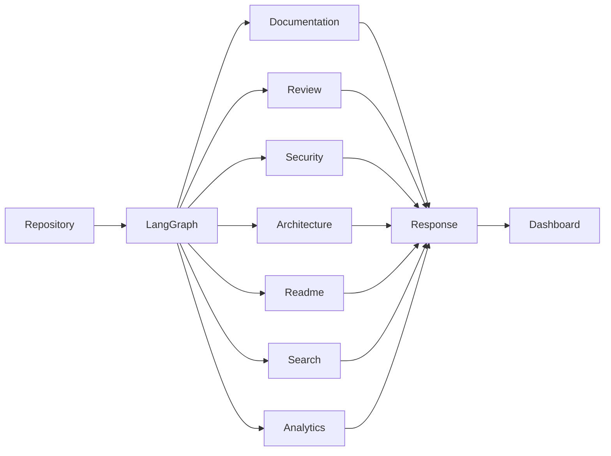
```mermaid
flowchart LR
Repository --> LangGraph
LangGraph --> Documentation
LangGraph --> Review
LangGraph --> Security
LangGraph --> Architecture
LangGraph --> Readme
LangGraph --> Search
LangGraph --> Analytics
Documentation --> Response
Review --> Response
Security --> Response
Architecture --> Response
Readme --> Response
Search --> Response
Analytics --> Response
Response --> Dashboard
```

---

# Documentation Generation Workflow

The Documentation Agent automatically creates project documentation by analyzing repository structure, modules, APIs, and comments.

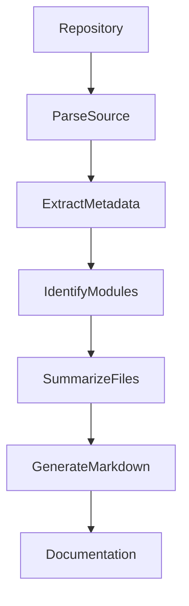
```mermaid
flowchart TD
Repository --> ParseSource --> ExtractMetadata --> IdentifyModules --> SummarizeFiles --> GenerateMarkdown --> Documentation
```

---

# README Generation Workflow

The README Agent generates a complete README.md using repository metadata and AI-generated insights.

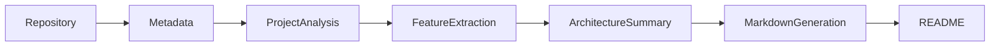
```mermaid
flowchart LR
Repository --> Metadata --> ProjectAnalysis --> FeatureExtraction --> ArchitectureSummary --> MarkdownGeneration --> README
```

---

# Architecture Generation Workflow

The Architecture Agent identifies relationships between modules and generates visual system diagrams.

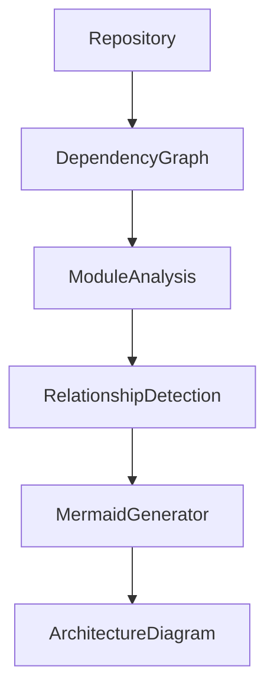
```mermaid
flowchart TD
Repository --> DependencyGraph --> ModuleAnalysis --> RelationshipDetection --> MermaidGenerator --> ArchitectureDiagram
```

---

# AI Code Review Workflow

The Code Review Agent evaluates code quality, maintainability, complexity, and best practices.

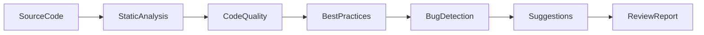
```mermaid
flowchart LR
SourceCode --> StaticAnalysis --> CodeQuality --> BestPractices --> BugDetection --> Suggestions --> ReviewReport
```

---

# Security Analysis Workflow

The Security Agent scans repositories for vulnerabilities, insecure dependencies, exposed secrets, and OWASP risks.

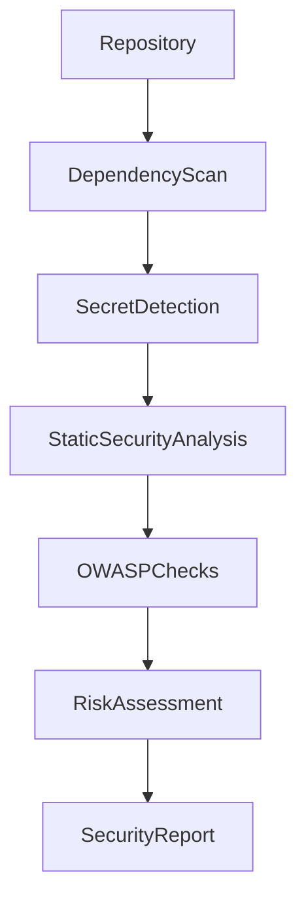
```mermaid
flowchart TD
Repository --> DependencyScan --> SecretDetection --> StaticSecurityAnalysis --> OWASPChecks --> RiskAssessment --> SecurityReport
```

---

# Dependency Analysis Workflow

The Dependency Agent constructs an internal dependency graph for better repository understanding.

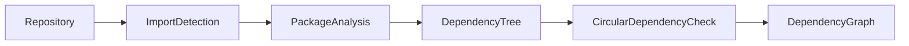
```mermaid
flowchart LR
Repository --> ImportDetection --> PackageAnalysis --> DependencyTree --> CircularDependencyCheck --> DependencyGraph
```

---

# Analytics Generation Workflow

The Analytics Agent produces engineering insights about the repository.

```mermaid
flowchart TD
Repository --> CollectMetrics --> LOCAnalysis --> ComplexityAnalysis --> LanguageStatistics --> RepositoryHealth --> DashboardMetrics
```

---

# AI Response Generation

After every AI agent completes its task, LangGraph merges all outputs into a single coherent response.

```mermaid
flowchart LR
Documentation --> Aggregator
Architecture --> Aggregator
Review --> Aggregator
Security --> Aggregator
Analytics --> Aggregator
Search --> Aggregator
Aggregator --> PromptBuilder --> GroqLLM --> FinalResponse
```

---

# Agent Communication Flow

Agents communicate through shared repository state managed by LangGraph.

```mermaid
flowchart TD
RepositoryState --> DocumentationAgent
RepositoryState --> ReviewAgent
RepositoryState --> ArchitectureAgent
RepositoryState --> SecurityAgent
RepositoryState --> AnalyticsAgent
DocumentationAgent --> SharedState
ReviewAgent --> SharedState
ArchitectureAgent --> SharedState
SecurityAgent --> SharedState
AnalyticsAgent --> SharedState
SharedState --> FinalResponse
```

---

# Parallel Execution Model

Independent AI agents execute simultaneously, reducing repository processing time.

```mermaid
flowchart LR
Repository --> LangGraph
LangGraph --> Agent1
LangGraph --> Agent2
LangGraph --> Agent3
LangGraph --> Agent4
LangGraph --> Agent5
LangGraph --> Agent6
LangGraph --> Agent7
Agent1 --> Finish
Agent2 --> Finish
Agent3 --> Finish
Agent4 --> Finish
Agent5 --> Finish
Agent6 --> Finish
Agent7 --> Finish
```

---

# Multi-Agent Benefits

| Feature | Benefit |
|----------|---------|
| Parallel Execution | Faster repository analysis |
| Modular Agents | Easy extensibility |
| Shared State | Consistent repository understanding |
| Specialized Prompts | Higher quality outputs |
| Independent Workflows | Better scalability |
| Result Aggregation | Unified AI responses |
| LangGraph DAG | Reliable execution flow |
| Context Sharing | Repository-aware intelligence |

---

# AI Processing Pipeline Summary

```text
Repository
      │
      ▼
Repository Parser
      │
      ▼
Knowledge Base
      │
      ▼
LangGraph Orchestrator
      │
 ┌────┼──────────────────────────────────────────┐
 │    │      │       │       │       │          │
 ▼    ▼      ▼       ▼       ▼       ▼          ▼
Docs README Review Security Search Analytics Architecture
 │    │      │       │       │       │          │
 └────────────── Result Aggregation ─────────────┘
                     │
                     ▼
                Groq LLM
                     │
                     ▼
             AI Repository Assistant
```

---

# Database Architecture

DevAssist separates structured metadata from semantic knowledge. Repository metadata is stored in a relational database, while embeddings are stored in a vector database for Retrieval-Augmented Generation (RAG).

```mermaid
erDiagram
USER ||--o{ REPOSITORY : owns
REPOSITORY ||--o{ FILE : contains
REPOSITORY ||--o{ CHAT : has
REPOSITORY ||--o{ AGENT_TASK : executes
REPOSITORY ||--o{ ANALYTICS : generates
FILE ||--o{ EMBEDDING : indexed_as
CHAT ||--o{ MESSAGE : contains
USER {
int id
string name
string email
string password
datetime createdAt
}
REPOSITORY {
int id
string githubUrl
string branch
string status
datetime importedAt
}
FILE {
int id
string path
string language
int repositoryId
}
EMBEDDING {
int id
string chunkId
vector embedding
}
CHAT {
int id
int repositoryId
}
MESSAGE {
int id
string role
text content
}
AGENT_TASK {
int id
string agent
string status
}
ANALYTICS {
int id
string metric
string value
}
```

---

# Database Schema Overview

| Table | Purpose |
|---------|----------|
| Users | Authentication |
| Repositories | Imported repositories |
| Files | Source code metadata |
| Embeddings | Vector embeddings |
| Chats | AI conversations |
| Messages | Chat history |
| Agent Tasks | LangGraph execution |
| Analytics | Repository insights |

---

# REST API Architecture

The frontend communicates exclusively through the Express REST API.

```mermaid
flowchart LR
Browser --> ExpressAPI
ExpressAPI --> Authentication
ExpressAPI --> RepositoryService
ExpressAPI --> AIService
ExpressAPI --> SearchService
ExpressAPI --> AnalyticsService
RepositoryService --> SQLite
SearchService --> VectorDB
AIService --> LangGraph
LangGraph --> Groq
AnalyticsService --> SQLite
```

---

# API Request Lifecycle

```mermaid
sequenceDiagram
actor User
participant React
participant API
participant Auth
participant Service
participant Database
User->>React: Click Action
React->>API: HTTP Request
API->>Auth: Validate JWT
Auth-->>API: Authorized
API->>Service: Execute Request
Service->>Database: Query Data
Database-->>Service: Result
Service-->>API: Response
API-->>React: JSON
React-->>User: Update UI
```

---

# Authentication Flow

DevAssist secures every API request using JWT-based authentication.

```mermaid
sequenceDiagram
actor User
participant Frontend
participant Backend
participant JWT
User->>Frontend: Login
Frontend->>Backend: Credentials
Backend->>JWT: Generate Token
JWT-->>Backend: Access Token
Backend-->>Frontend: JWT
Frontend->>Backend: Protected Request
Backend->>JWT: Verify Token
JWT-->>Backend: Valid
Backend-->>Frontend: Protected Response
```

---

# Authorization Workflow

```mermaid
flowchart TD
Request --> JWTValidation
JWTValidation --> Valid
JWTValidation --> Invalid
Valid --> UserContext
UserContext --> RoleCheck
RoleCheck --> Authorized
RoleCheck --> Unauthorized
Authorized --> ExecuteAPI
Unauthorized --> Error403
Invalid --> Error401
```

---

# Repository Processing API

```mermaid
flowchart LR
Client --> PostImport[POST Repository Import] --> RepoService[Repository Service] --> CloneRepo[Clone Repository] --> RepoParser[Repository Parser] --> EmbedService[Embedding Service] --> LangGraph --> Ready[Repository Ready]
```

---

# Deployment Architecture

DevAssist is designed for cloud-native deployment.

```mermaid
flowchart LR
User --> Browser --> Nginx --> ReactFrontend --> ExpressBackend
ExpressBackend --> SQLite
ExpressBackend --> VectorDB
ExpressBackend --> LangGraph
LangGraph --> GroqAPI
ExpressBackend --> GitHubAPI
```

---

# Docker Architecture

```mermaid
flowchart TD
DockerCompose --> FrontendContainer
DockerCompose --> BackendContainer
DockerCompose --> SQLiteVolume
DockerCompose --> VectorDB
BackendContainer --> SQLiteVolume
BackendContainer --> VectorDB
FrontendContainer --> BackendContainer
```

---

# CI/CD Pipeline

Every commit automatically triggers testing, building, and deployment.

```mermaid
flowchart LR
Developer --> GitHub --> GitHubActions
GitHubActions --> Install
Install --> Lint
Lint --> Test
Test --> Build
Build --> Docker
Docker --> Deploy
Deploy --> Production
```

---

# Production Infrastructure

```mermaid
flowchart TD
Internet --> LoadBalancer --> Frontend
Frontend --> API
API --> Database
API --> VectorDB
API --> LangGraph
LangGraph --> Groq
API --> GitHub
```

---

# Monitoring Architecture

```mermaid
flowchart LR
Application --> Logs
Application --> Metrics
Application --> HealthChecks
Logs --> Dashboard
Metrics --> Dashboard
HealthChecks --> Dashboard
Dashboard --> Admin
```

---

# Performance Optimization Pipeline

```mermaid
flowchart LR
Request --> CacheCheck
CacheCheck --> CacheHit
CacheCheck --> CacheMiss
CacheMiss --> VectorSearch
VectorSearch --> Groq
Groq --> Response
CacheHit --> Response
```

---

# Security Architecture

```mermaid
flowchart TD
User --> HTTPS --> JWTAuthentication --> Authorization --> InputValidation --> RateLimiter --> BusinessLogic --> Database
```

---

# Project Structure

```text
devassist/

├── dashboard/
│   ├── components/
│   ├── pages/
│   ├── hooks/
│   ├── stores/
│   ├── services/
│   └── layouts/
│
├── api/
│   ├── controllers/
│   ├── routes/
│   ├── middlewares/
│   ├── validators/
│   └── services/
│
├── orchestrator/
│   ├── graph/
│   ├── nodes/
│   ├── edges/
│   ├── state/
│   └── workflows/
│
├── agents/
│   ├── documentation/
│   ├── readme/
│   ├── architecture/
│   ├── security/
│   ├── review/
│   ├── analytics/
│   └── search/
│
├── core/
│   ├── database/
│   ├── embeddings/
│   ├── github/
│   ├── parser/
│   ├── chunker/
│   └── utils/
│
├── docs/
├── docker/
├── tests/
├── scripts/
└── server.ts
```

---

# Infrastructure Summary

| Component | Technology |
|------------|------------|
| Frontend | React + TypeScript |
| Backend | Express + Node.js |
| AI Framework | LangGraph |
| LLM | Groq |
| Authentication | JWT |
| Database | SQLite |
| Vector Store | Chroma / Pinecone / FAISS |
| Documentation | Markdown |
| Containerization | Docker |
| Reverse Proxy | Nginx |
| CI/CD | GitHub Actions |
| Monitoring | Prometheus / Grafana |

---

# Architecture Highlights

- Enterprise-ready layered architecture
- Modular AI agent system
- Retrieval-Augmented Generation (RAG)
- Parallel LangGraph execution
- Repository-aware semantic search
- JWT-based authentication
- Cloud-native deployment
- Docker-ready infrastructure
- CI/CD automation
- Scalable and extensible design


---

# Core Features

DevAssist combines Artificial Intelligence, Retrieval-Augmented Generation (RAG), Semantic Search, and Multi-Agent orchestration into a unified software engineering platform.

The platform consists of several intelligent modules working together to automate repository understanding, documentation, architecture generation, code reviews, and software analysis.

---

# AI Repository Chat

## Overview

The AI Repository Chat enables developers to interact with an entire codebase using natural language. Instead of manually searching through hundreds of files, users can simply ask questions such as:

- Explain this project
- How does authentication work?
- Where is JWT implemented?
- Show database relationships
- Explain API architecture
- Which files use LangGraph?
- Find all security middleware.

The assistant retrieves only the most relevant repository context before generating responses using Groq LLMs.

---

## Features

- Repository-aware conversations
- Contextual answers
- Code explanation
- Architecture explanation
- API understanding
- Dependency reasoning
- Cross-file understanding
- Conversation history

---

## Workflow

```mermaid
flowchart LR
Question --> Embedding --> VectorSearch[Vector Search] --> RelevantFiles[Relevant Files] --> ContextBuilder[Context Builder] --> GroqLLM[Groq LLM] --> Answer
```

---

<p align="center">

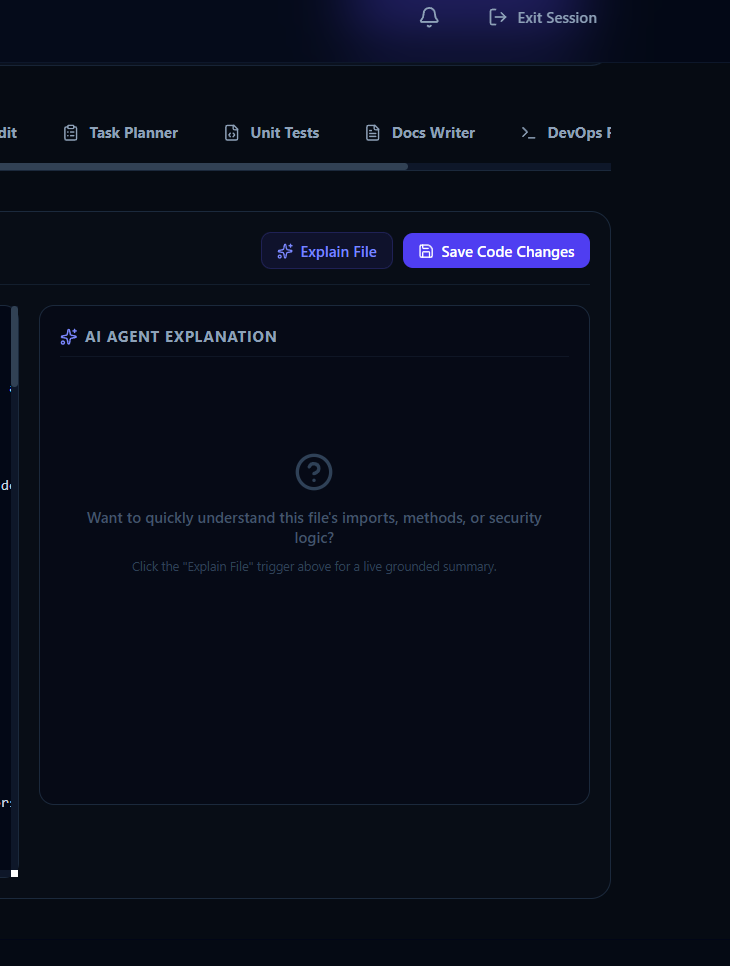

</p>

---

# GitHub Repository Import

## Overview

Import public or private GitHub repositories directly into DevAssist.

The platform automatically:

- validates the repository
- clones the repository
- indexes the project
- generates embeddings
- prepares the repository for AI analysis

---

## Supported

- Public repositories

- Private repositories

- GitHub Personal Access Tokens

- Branch selection

- Re-import repositories

- Incremental indexing

---

## Workflow

```mermaid
flowchart LR
GitHub --> Validate[Repository Validation] --> Clone[Clone Repository] --> SaveMeta[Save Metadata] --> Ready[Repository Ready]
```

---

<p align="center">

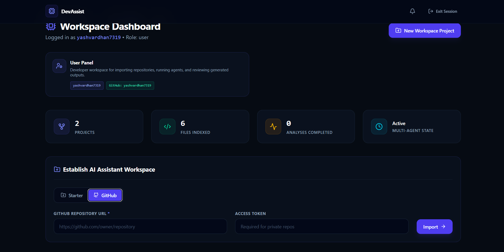

</p>

---

# Repository Explorer

Browse the repository structure directly inside the dashboard.

Features include:

- Tree navigation

- Folder expansion

- File preview

- Syntax highlighting

- Language detection

- Search

- File metadata

---

Workflow

```mermaid
flowchart LR
Repository --> TreeBuilder[Tree Builder] --> Explorer --> Developer
```

---

<p align="center">

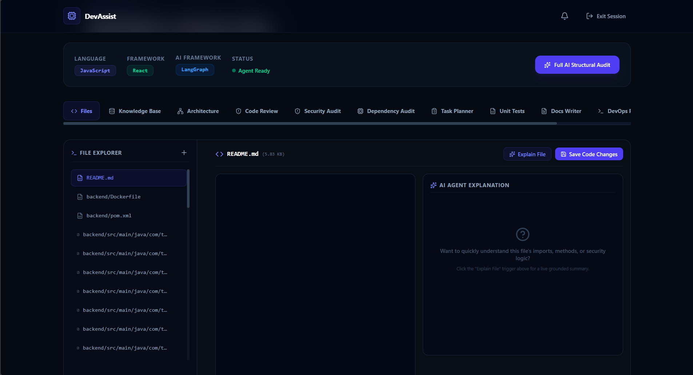

</p>

---

# Semantic Repository Search

Unlike keyword search, semantic search understands the intent behind your queries.

Example searches:

> Authentication middleware

> Payment implementation

> JWT validation

> Error handling

> AI agents

> Database schema

The search engine retrieves semantically similar code instead of exact text matches.

---

Capabilities

- Vector Search

- Similarity Search

- Metadata Filtering

- Context Retrieval

- File Ranking

---

Workflow

```mermaid
flowchart LR
Query --> Embedding --> VectorSearch[Vector Search] --> Ranking --> Context --> Results
```

---

<p align="center">

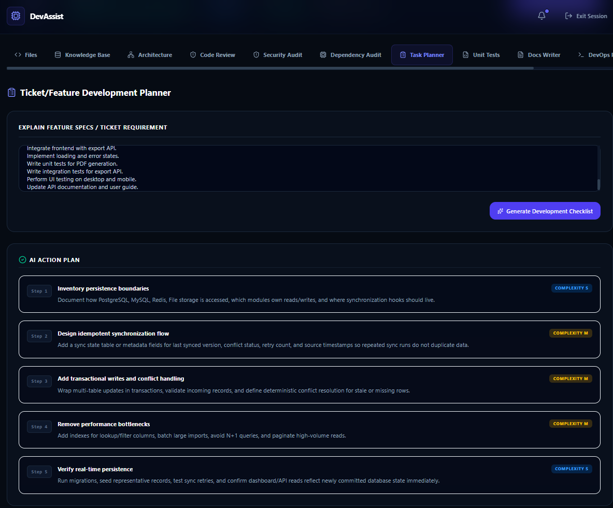

</p>

---

# AI Documentation Generator

Automatically generates technical documentation for repositories.

Generated documentation includes:

- Module Documentation

- API Documentation

- Folder Documentation

- Class Documentation

- Function Documentation

- Dependency Documentation

---

Workflow

```mermaid
flowchart TD
Repository --> Analyze --> Summarize --> MarkdownGen[Markdown Generator] --> Documentation
```

---

<p align="center">

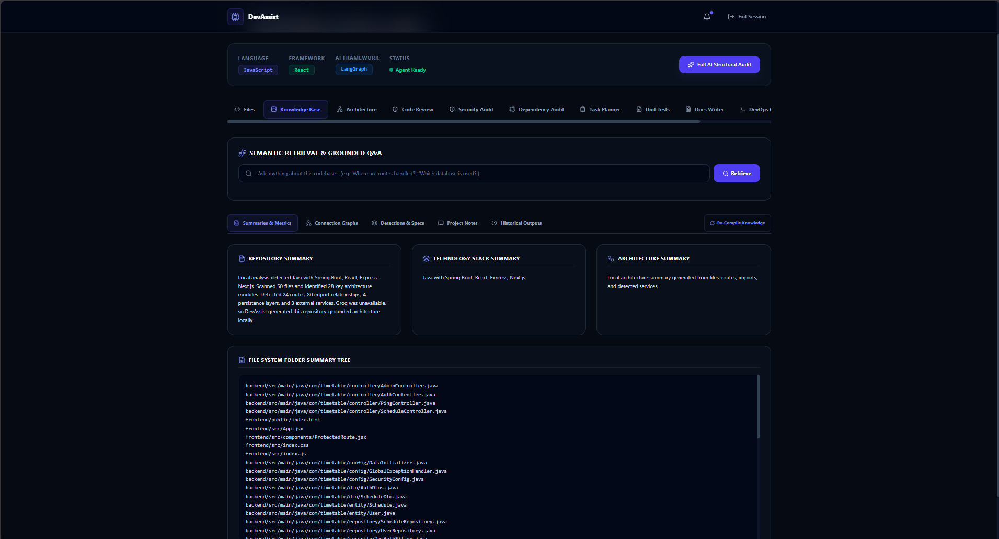

</p>

---

# AI README Generator

Generate professional README files for any repository.

Generated sections include:

- Installation

- Features

- Tech Stack

- Architecture

- Usage

- License

- Contribution Guide

- API Reference

- Screenshots

---

Workflow

```mermaid
flowchart TD
Repository --> Analysis[Repository Analysis] --> MarkdownGen[Markdown Generator] --> Readme[README.md]
```

---

<p align="center">

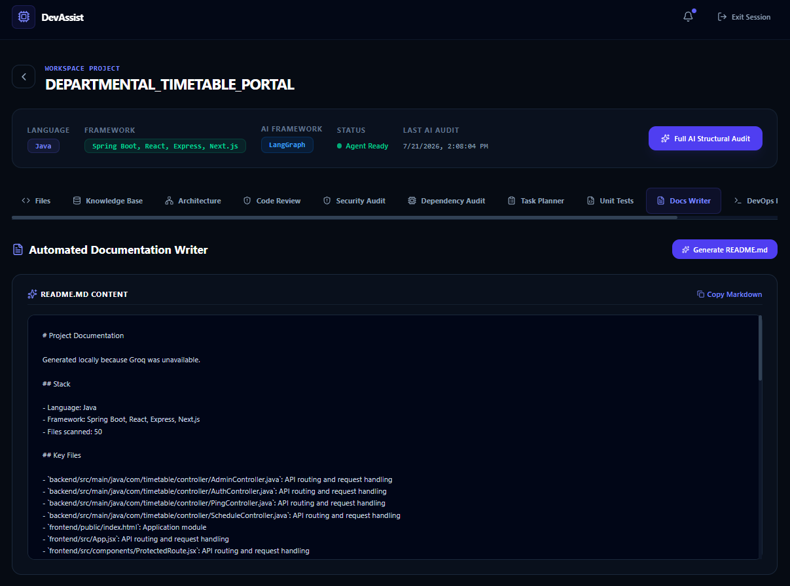

</p>

---

# AI Architecture Generator

Automatically generates architecture documentation and Mermaid diagrams.

Supported diagrams:

- System Architecture

- Component Diagram

- Sequence Diagram

- Flowchart

- Entity Relationship Diagram

- Deployment Diagram

- Workflow Diagram

---

Workflow

```mermaid
flowchart LR
Repository --> DepGraph[Dependency Graph] --> ArchAnalysis[Architecture Analysis] --> MermaidGen[Mermaid Generator] --> Diagram
```

---

<p align="center">

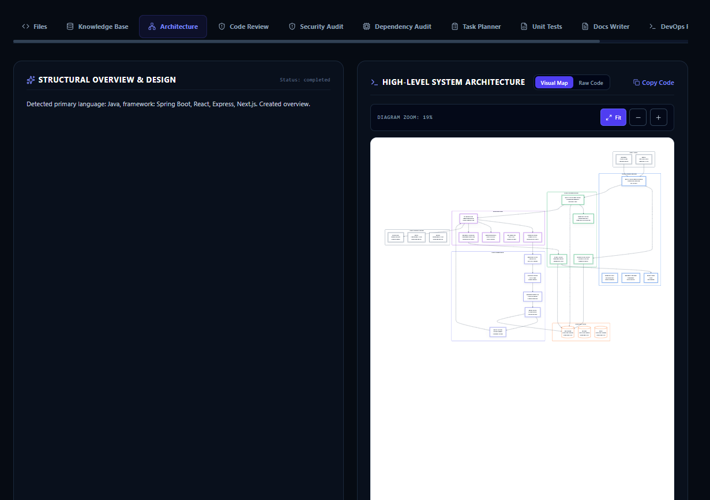

</p>

---

# AI Code Review

Analyze repositories for:

- Code Smells

- Bugs

- Maintainability

- Best Practices

- Complexity

- Duplicate Code

- Dead Code

- Naming Issues

- Performance Problems

---

Workflow

```mermaid
flowchart LR
SourceCode[Source Code] --> StaticAnalysis[Static Analysis] --> AIReview[AI Review] --> Suggestions --> Report
```

---

<p align="center">

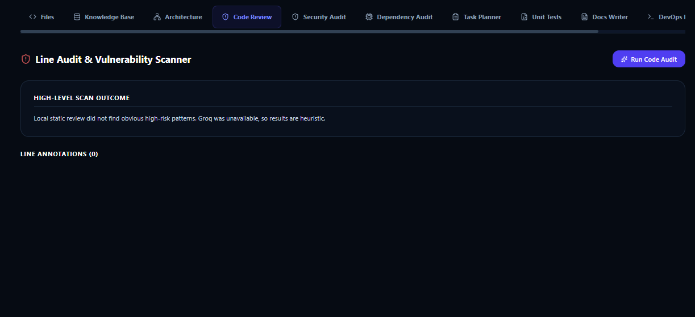

</p>

---

# AI Security Scanner

Detects:

- Hardcoded Secrets

- API Keys

- SQL Injection

- XSS

- Authentication Issues

- OWASP Top 10

- Dependency Vulnerabilities

- Weak Encryption

---

Workflow

```mermaid
flowchart TD
Repository --> SecurityAnalysis[Security Analysis] --> RiskDetection[Risk Detection] --> Report
```

---

<p align="center">

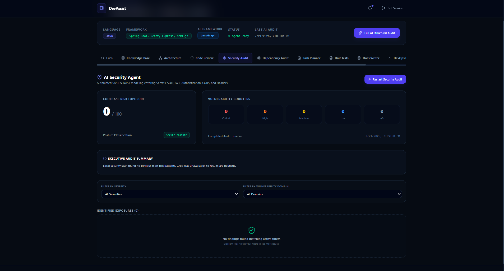

</p>

---

# Dependency Analysis

Visualizes relationships between packages, modules, and services.

Capabilities:

- Dependency Graph

- Circular Dependency Detection

- Package Analysis

- Import Graph

- Module Relationships

---

Workflow

```mermaid
flowchart LR
Repository --> Imports --> DepGraph[Dependency Graph] --> Visualization
```

---

<p align="center">

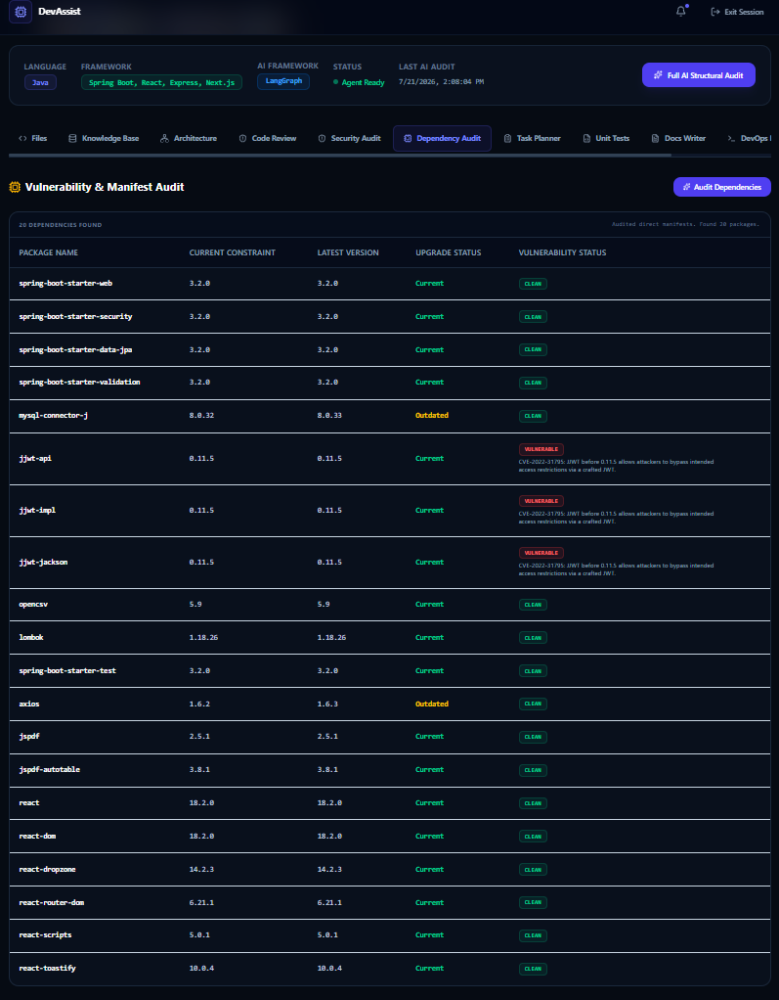

</p>

---

# Repository Analytics Dashboard

Monitor repository health through real-time analytics.

Metrics include:

- Total Files

- Languages

- Commits

- Contributors

- AI Tokens

- Processing Time

- Documentation Coverage

- Security Score

- Code Quality

- Repository Health

---

Workflow

```mermaid
flowchart LR
Repository --> Metrics --> AnalyticsEngine[Analytics Engine] --> Dashboard
```

---

<p align="center">

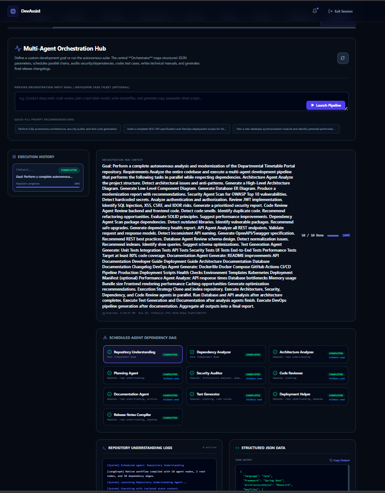

</p>

---

# AI Report Export

Export repository insights into professional reports.

Supported Formats

- PDF

- Markdown

- HTML

- JSON

Reports include:

- Documentation

- Code Review

- Security Analysis

- Architecture

- Analytics

---

Workflow

```mermaid
flowchart LR
Analysis --> ReportGen[Report Generator] --> Export --> Formats["PDF / HTML / Markdown"]
```

---

# Feature Summary

| Feature | Status |
|----------|--------|
| AI Repository Chat | Yes |
| GitHub Import | Yes |
| Repository Explorer | Yes |
| Semantic Search | Yes |
| Documentation Generator | Yes |
| README Generator | Yes |
| Architecture Generator | Yes |
| AI Code Review | Yes |
| Security Scanner | Yes |
| Dependency Analysis | Yes |
| Repository Analytics | Yes |
| Report Export | Yes |

---

# Why These Features Matter

DevAssist is more than a chatbot. It is an AI-powered software engineering platform that helps developers:

- Understand repositories faster
- Generate documentation automatically
- Perform semantic code search
- Review code intelligently
- Visualize software architecture
- Detect security issues
- Analyze dependencies
- Monitor repository health
- Produce engineering reports
- Improve developer productivity

---

---

# Technology Stack

DevAssist is built using a modern, scalable, and enterprise-grade technology stack. Each technology has been carefully selected to provide high performance, maintainability, and developer productivity.

---

# Frontend Stack

The frontend provides a modern developer experience with a responsive dashboard, AI chat interface, repository explorer, and analytics.

| Technology | Purpose |
|------------|---------|
| React 19 | Component-based UI |
| TypeScript | Type Safety |
| Vite | Lightning-fast Build Tool |
| Tailwind CSS v4 | Utility-first Styling |
| Zustand | Global State Management |
| React Query | Server State Management |
| Framer Motion | Animations |
| React Router | Client-side Routing |
| Mermaid.js | Architecture Diagrams |
| Lucide Icons | Icon Library |
| React Hook Form | Form Management |
| Zod | Schema Validation |

---

# Backend Stack

The backend exposes REST APIs and coordinates repository processing.

| Technology | Purpose |
|------------|---------|
| Node.js | Runtime |
| Express.js | REST API |
| TypeScript | Type Safety |
| JWT | Authentication |
| Multer | File Uploads |
| Axios | HTTP Requests |
| CORS | Cross-Origin Requests |
| dotenv | Environment Variables |

---

# AI Stack

DevAssist leverages Retrieval-Augmented Generation (RAG) together with Multi-Agent orchestration.

| Technology | Purpose |
|------------|---------|
| LangGraph | Multi-Agent Workflow Engine |
| LangChain | AI Framework |
| Groq SDK | LLM Inference |
| llama-3.3-70b-versatile | Large Language Model |
| Embedding Model | Semantic Embeddings |
| RAG | Repository-aware AI |

---

# Database Stack

| Technology | Purpose |
|------------|---------|
| SQLite | Repository Metadata |
| ChromaDB / Pinecone / FAISS | Vector Database |
| Prisma (Optional) | ORM |

---

# DevOps & Infrastructure

| Technology | Purpose |
|------------|---------|
| Docker | Containerization |
| Docker Compose | Local Deployment |
| GitHub Actions | CI/CD |
| Nginx | Reverse Proxy |
| Render / Railway | Cloud Deployment |
| AWS EC2 | VPS Deployment |

---

# Testing Stack

| Technology | Purpose |
|------------|---------|
| Vitest | Unit Testing |
| React Testing Library | Component Testing |
| Playwright | End-to-End Testing |
| ESLint | Code Quality |
| Prettier | Code Formatting |

---

# Third-Party Integrations

| Service | Purpose |
|---------|---------|
| GitHub API | Repository Import |
| Groq API | AI Inference |
| OAuth | Authentication |
| Markdown | Documentation |
| Mermaid | Diagram Generation |

---

# Complete Technology Overview

```text
Frontend
│
├── React 19
├── TypeScript
├── Tailwind CSS
├── Zustand
├── React Query
├── Mermaid
└── Framer Motion

Backend
│
├── Node.js
├── Express
├── JWT
├── Multer
└── Axios

AI
│
├── LangGraph
├── LangChain
├── Groq
├── Llama 3
└── RAG

Database
│
├── SQLite
└── Vector Database

Infrastructure
│
├── Docker
├── GitHub Actions
├── Nginx
└── Cloud Hosting
```

---

# Project Structure

The project follows a modular architecture that separates concerns and promotes maintainability.

```text
devassist/
│
├── dashboard/                     # React Frontend
│
│   ├── components/
│   ├── layouts/
│   ├── pages/
│   ├── hooks/
│   ├── services/
│   ├── stores/
│   ├── utils/
│   ├── styles/
│   └── assets/
│
├── api/                           # Express Backend
│
│   ├── controllers/
│   ├── routes/
│   ├── middlewares/
│   ├── validators/
│   ├── services/
│   ├── repositories/
│   └── config/
│
├── orchestrator/                  # LangGraph
│
│   ├── graph/
│   ├── nodes/
│   ├── workflows/
│   ├── state/
│   └── utils/
│
├── agents/
│
│   ├── documentation/
│   ├── readme/
│   ├── architecture/
│   ├── review/
│   ├── security/
│   ├── dependency/
│   ├── analytics/
│   └── search/
│
├── core/
│
│   ├── github/
│   ├── parser/
│   ├── chunker/
│   ├── embeddings/
│   ├── vectordb/
│   ├── database/
│   ├── config/
│   └── utils/
│
├── docs/
│
│   ├── architecture/
│   ├── diagrams/
│   ├── screenshots/
│   └── reports/
│
├── tests/
│
│   ├── unit/
│   ├── integration/
│   └── e2e/
│
├── docker/
│
├── scripts/
│
├── .github/
│
│   └── workflows/
│
├── .env.example
├── package.json
├── tsconfig.json
├── vite.config.ts
├── docker-compose.yml
├── Dockerfile
└── README.md
```

---

# Directory Responsibilities

| Directory | Responsibility |
|------------|---------------|
| dashboard | Frontend UI |
| api | REST APIs |
| orchestrator | LangGraph Execution |
| agents | AI Agents |
| core | Shared Business Logic |
| docs | Documentation |
| tests | Testing |
| docker | Docker Configuration |
| scripts | Automation Scripts |
| .github | GitHub Actions |

---

# Prerequisites

Before running DevAssist, ensure the following software is installed:

- Node.js **22+**
- npm **10+**
- Git
- Docker (Optional)
- Groq API Key
- GitHub Personal Access Token (Optional)

Verify installation:

```bash
node -v
npm -v
git --version
docker --version
```

---

# Environment Variables

Create a `.env` file in the project root.

```env
# Server
NODE_ENV=development
PORT=3000

# Authentication
JWT_SECRET=your_secret_key

# AI
GROQ_API_KEY=gsk_xxxxxxxxxxxxxxxxxxxxxx

# GitHub
GITHUB_TOKEN=ghp_xxxxxxxxxxxxxxxxxxxxx

# Database
DATABASE_URL=sqlite:./devassist.db

# Vector Database
VECTOR_DB=chroma

# Logging
LOG_LEVEL=info
```

---

# Installation

Clone the repository.

```bash
git clone https://github.com/yourusername/devassist.git
```

Move into the project.

```bash
cd devassist
```

Install dependencies.

```bash
npm install
```

Configure environment variables.

```bash
cp .env.example .env
```

Start the development server.

```bash
npm run dev
```

---

# ▶ Quick Start

Run the frontend.

```bash
npm run dev
```

Run the backend.

```bash
npm run server
```

Open your browser.

```
http://localhost:5173
```

Import a repository and begin analyzing your codebase.

---

# Available Scripts

| Command | Description |
|----------|-------------|
| npm run dev | Start Frontend |
| npm run server | Start Backend |
| npm run build | Production Build |
| npm run preview | Preview Production |
| npm run lint | Lint Code |
| npm run test | Run Tests |
| npm run format | Format Code |
| npm run docker | Start Docker Environment |

---

# Development Workflow

```mermaid
flowchart LR
Clone --> Install --> Configure --> Run --> ImportRepo[Import Repository] --> RepoAnalysis[Repository Analysis] --> AIProcessing[AI Processing] --> Dashboard
```

---

# Technology Summary

| Category | Stack |
|----------|-------|
| Frontend | React, TypeScript, Tailwind CSS |
| Backend | Node.js, Express |
| AI | LangGraph, LangChain, Groq |
| Database | SQLite |
| Vector Store | Chroma / Pinecone / FAISS |
| Authentication | JWT |
| Deployment | Docker |
| CI/CD | GitHub Actions |
| Testing | Vitest, Playwright |

---

# License

This project is licensed under the **MIT License**.

```
Copyright (c) 2026 Yash Vardhan

Permission is hereby granted, free of charge, to any person obtaining a copy
of this software and associated documentation files (the "Software"), to
deal in the Software without restriction, including without limitation the
rights to use, copy, modify, merge, publish, distribute, sublicense, and/or
sell copies of the Software, and to permit persons to whom the Software is
furnished to do so, subject to the following conditions:

The above copyright notice and this permission notice shall be included in
all copies or substantial portions of the Software.

THE SOFTWARE IS PROVIDED "AS IS", WITHOUT WARRANTY OF ANY KIND, EXPRESS OR
IMPLIED, INCLUDING BUT NOT LIMITED TO THE WARRANTIES OF MERCHANTABILITY,
FITNESS FOR A PARTICULAR PURPOSE AND NONINFRINGEMENT. IN NO EVENT SHALL THE
AUTHORS OR COPYRIGHT HOLDERS BE LIABLE FOR ANY CLAIM, DAMAGES OR OTHER
LIABILITY, WHETHER IN AN ACTION OF CONTRACT, TORT OR OTHERWISE, ARISING
FROM, OUT OF OR IN CONNECTION WITH THE SOFTWARE OR THE USE OR OTHER
DEALINGS IN THE SOFTWARE.
```

Full text also lives in the [LICENSE](LICENSE) file at the root of the repo.
